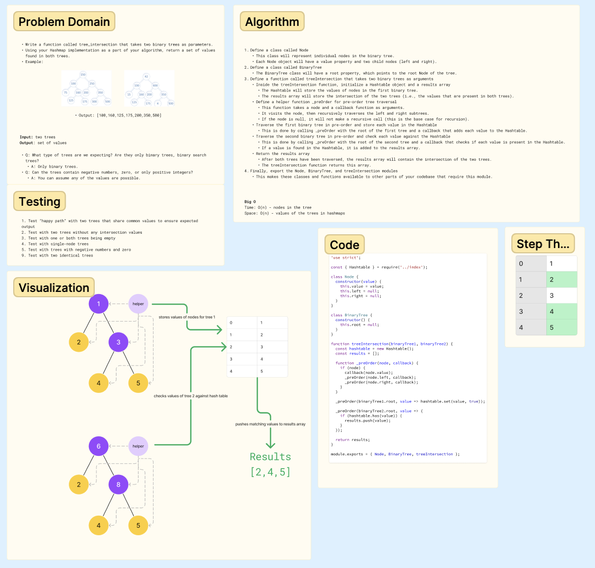

# Documentation: 401 Code Challenge - Class 32

## Hashtable Implementation

## Whiteboard Process

## Approach & Efficiency

**Challenge**
- Write a function called tree_intersection that takes two binary trees as parameters.
- Using your Hashmap implementation as a part of your algorithm, return a set of values found in both trees.

**Approach**
The approach I took for this problem involved using a hash table to store and look up values for efficiency. 

**Efficiency**:
The time complexity of this solution is O(n), where n is the number of nodes in the larger tree. This is because each node in both trees needs to be visited once in order to compare all the values.

The space complexity is also O(n) for the same reason. In the worst-case scenario (when all values are unique), every value from the first tree would need to be stored in the hashtable. So the space required grows linearly with the size of the tree.

This approach is efficient because it allows us to quickly check if a value from the second tree is in the first tree by checking the hashtable, which can be done in constant time. This prevents the need for a nested loop, which would have a time complexity of O(n^2).

**Big O:**

- Time -> O(n)
- Space -> O(n)

## Solution

See [index.js](class-30/treeIntersection/tree-intersection.js)

## Tests

 PASS  treeIntersection/tree-intersection.test.js
  treeIntersection
    ✓ should find common values in 2 binary trees (1 ms)
    ✓ should return an empty array if there are no common values
    ✓ should return an empty array if one or both of the trees are empty (1 ms)

## References & Collaborations

- Used OpenAI's GPT-3 model to assist with BigO and test case development.
