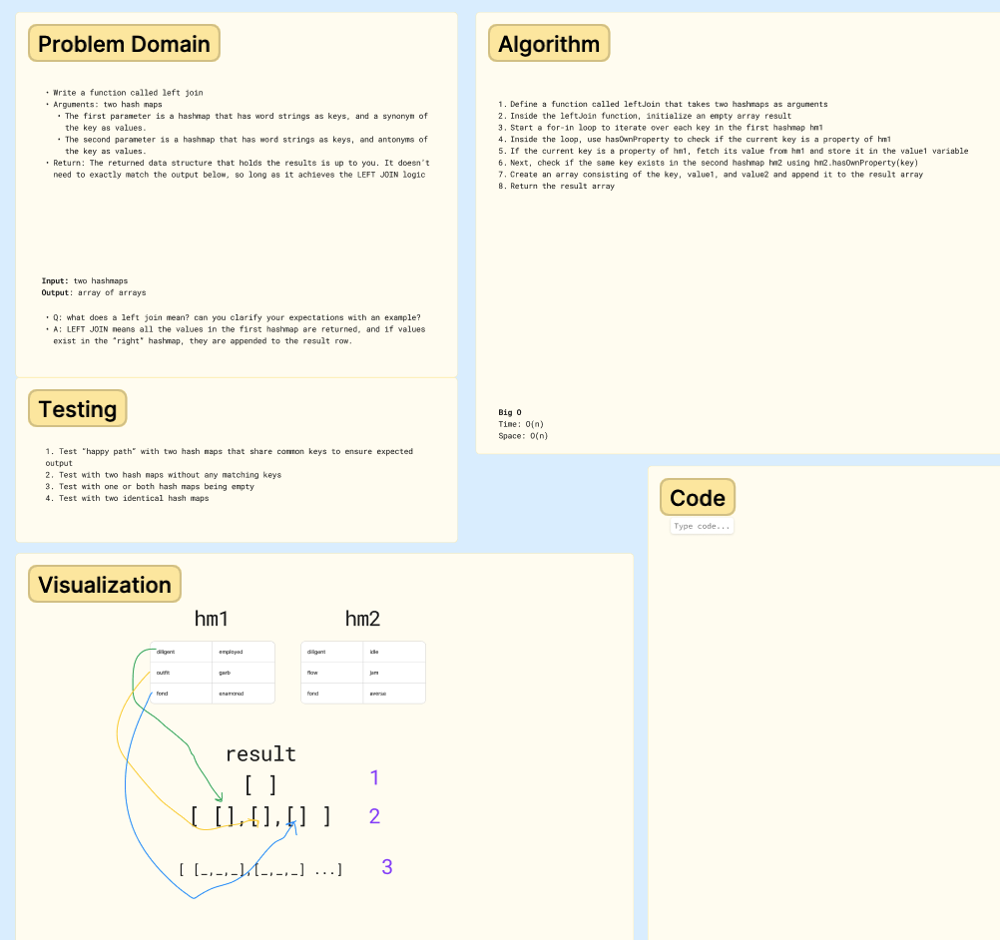

# Documentation: 401 Code Challenge - Class 32

## Implement a simplified LEFT JOIN for 2 Hashmaps.

## Whiteboard Process



## Approach & Efficiency

Write a function that LEFT JOINs two hashmaps into a single data structure.

- Write a function called left join
- Arguments: two hash maps
  - The first parameter is a hashmap that has word strings as keys, and a synonym of the key as values.
  - The second parameter is a hashmap that has word strings as keys, and antonyms of the key as values.
- Return: The returned data structure that holds the results is up to you. It doesn’t need to exactly match the output below, so long as it achieves the LEFT JOIN logic

**Big O:**

- Time: O(n)
- Space: O(n)

## Solution

See [index.js](401-challenges/class-30/index.js)

## Tests

Test cases include:

- Setting a key-value pair in the hashtable
- Retrieving the value associated with a given key
- Checking if a key exists in the hashtable
- Successfully returning a list of all unique keys in the hashtable
- Handling collisions within the hashtable
- Retrieving a value from a bucket within the hashtable that has a collision
- Generating a hash for a given key that is within range

```
PASS  __tests__/hashtable.test.js
  Hashtable
    ✓ Can successfully set a key-value pair in the hashtable (1 ms)
    ✓ Can successfully get the value associated with a given key
    ✓ Can successfully check if a key exists in the hashtable (1 ms)
    ✓ Can successfully return a list of all unique keys in the hashtable
    ✓ Can successfully handle a collision within the hashtable
    ✓ Can successfully retrieve a value from a bucket within the hashtable that has a collision
    ✓ Can successfully hash a key to an in-range value
```

*Note: replace the above with the actual test results from your code.*

## References & Collaborations

- Used OpenAI's GPT-3 model to assist with BigO and test case development.
